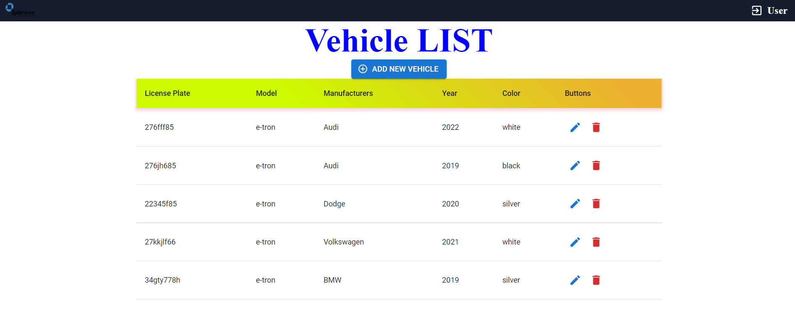
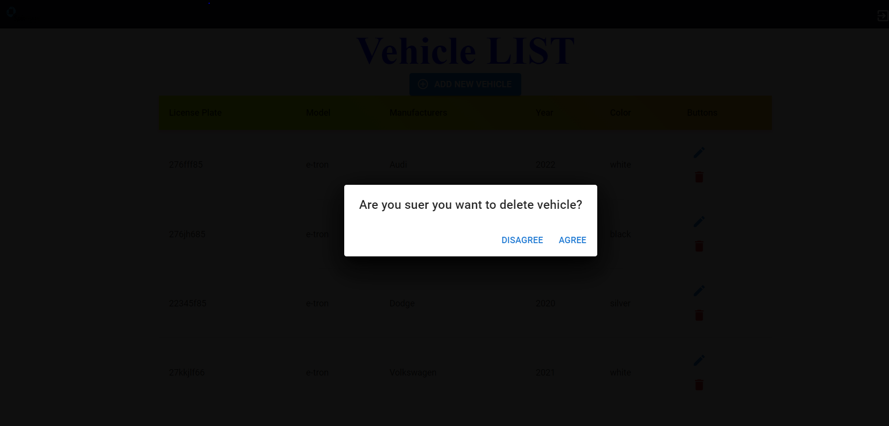
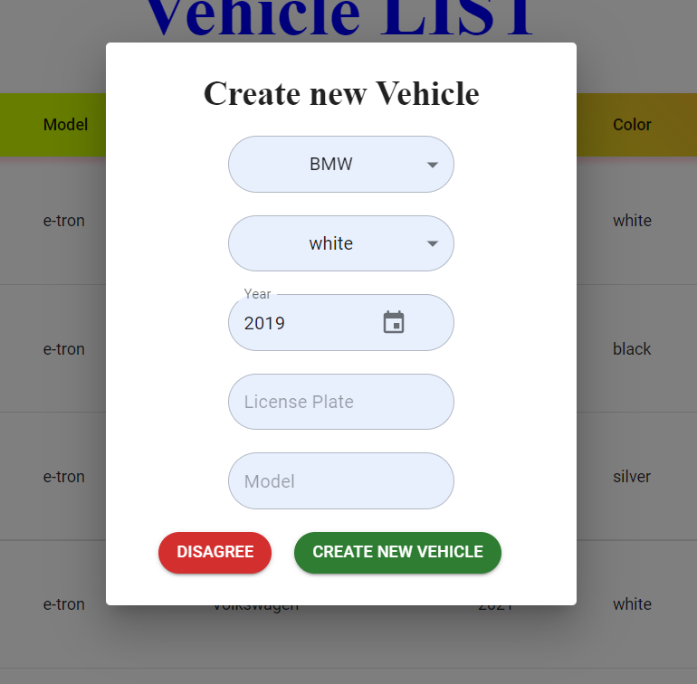
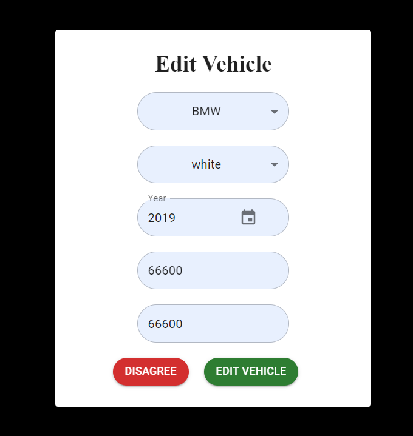

<h1 align="center"> Spinframe - Cloud-Base Technology Services⚡🌍 </h1>
<h3 align="center"> Vehicle-Fleet </h3>

Public REST API to get vehicles Types, Brands and CRUD vehicles

<h2> :floppy_disk: Project Features Library and Languages Description</h2>

### Front-End
* JavaScript.
* Material-UI for component and style.
* Frameword react.

### Backend
*  CORE NET.ASP C#.

### Data Base
*  MSSQL

<h2> :book: Introduction</h2>

This repository contains an sample CRUD (Create, Read, Update, and Delete) API written in react and ASP.NET Core . You will need to have ASP.NET Core installed. All the other dependencies will be downloaded from NuGet. 

## Screenshots

Home Page  
======

Delete
======
  

Create new Vehicle  |  Edit Vehicle
:------------------------:|:-------------------------:
  |   

<h2> :clipboard: Execution Instruction</h2>

The order of execution of the program files is as follows:

First, git clone https://github.com/idankario/Vehicle-Fleet

<b>2) npm i</b>

<a href="https://documenter.getpostman.com/view/17930872/2s7Ytaequr">postman collection</a>

<!-- CREDITS -->
<h2 id="credits"> :scroll: Credits</h2>

Idan Kario 

